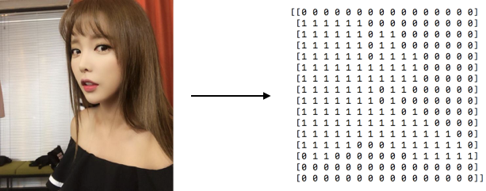
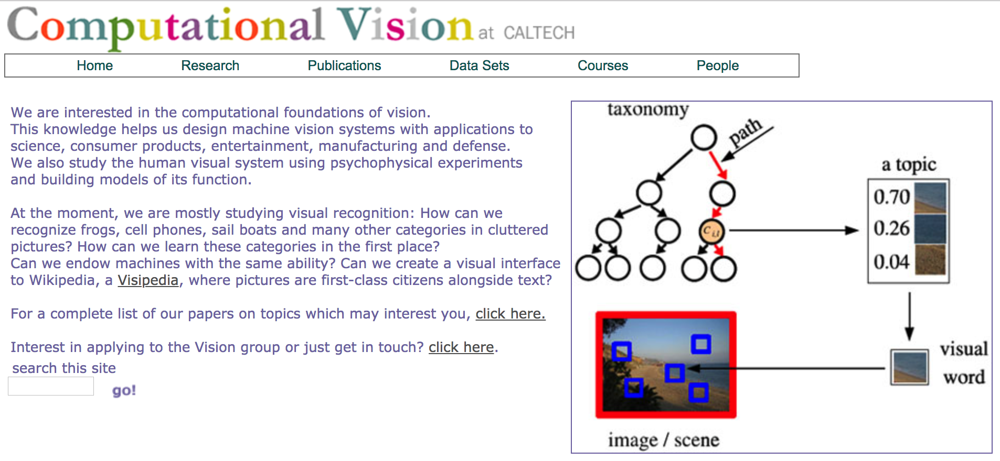
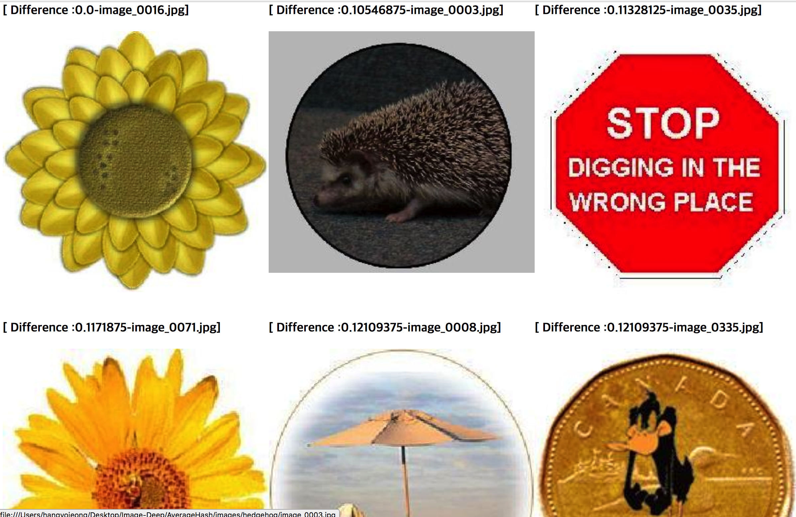

# Image-DeepLearning
Study that Search Similar Images

## AverageHash
Use AverageHash Method
Image data is very various(Different resolution, compression form(such as jpeg, png, ...)....) 
If we check the different of image binary data, we need standard image form
Using AverageHash, we can make image to standard

### Process
1. Resize the image(8x8)
2. Convert the Image to GrayScale
3. Calculate the Image Pixel Average
4. If the pixel number is bigger than average change number to 1, opposite is 0

### avhash.py
How to make AverageHash

### avhash-search.py
Search Similar Images to use AverageHash
#### DataSet
Caltech Computational Vision(http://www.vision.caltech.edu/archive.html)

#### Result Page

